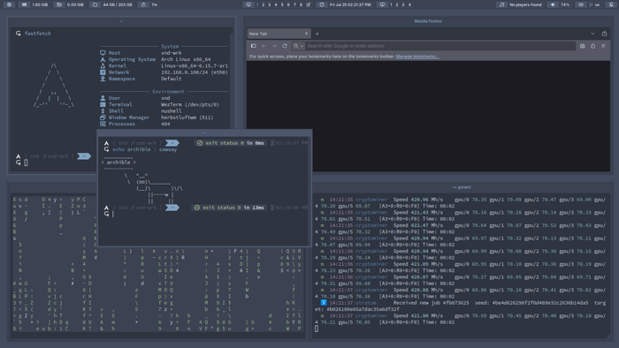
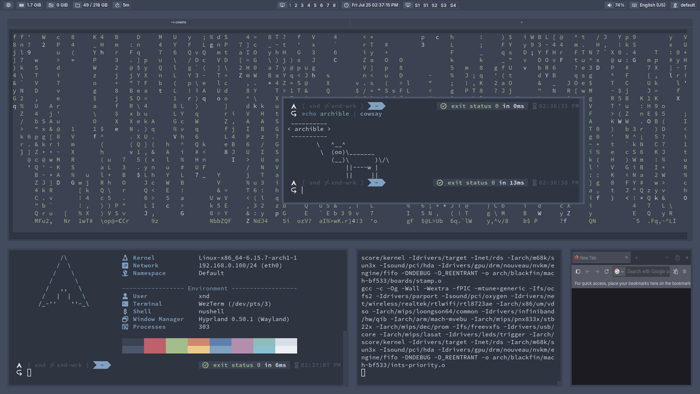

# archible


## Description

**archible** provides a complete, declarative desktop provisioning setup for **Arch Linux**, powered by **Ansible**.

### Core Features

- **Headless Provisioning**: Set up systems from scratch, even on non-bootable targets, using *systemd-nspawn* containers.
- **Flexible Execution**: Run playbooks from ArchISO, over SSH on a running system, or locally on the target machine.
- **Extensible**: A rich ecosystem of roles and plugins covers every aspect of system provisioning, from environment
  variables to dynamic user directory layout.
- **Deep Customization**: Fine-tune advanced system settings including systemd, udev, ALSA, GSettings, and other system
  quirks.
- **Highly Configurable**: Tailor setups with roles, variables and templates in an intuitive namespacing hierarchy.

## Screenshots




Full-sized versions are available at [`./roles/aa-global/aa-shared/files`](./roles/aa-global/aa-shared/files).

## Getting Started

### 1. Clone the Repository

First, clone the repository to your local machine.

```shell
git clone https://github.com/example/archible
```

### 2. Define Inventory

This project follows a standard Ansible inventory structure. For an introduction to this concept, see
[Building Ansible inventories](https://docs.ansible.com/ansible/latest/inventory_guide/index.html) in the official
documentation.

The easiest way to get started is by copying and modifying the provided example:

- Host Declaration: [`./inventories/example.yml`](./inventories/example.yml)
- Group Variables: [`./inventories/group_vars/example/*.yml`](./inventories/group_vars/example)

In order to get started with group variables, explore the following sections:

- [Hierarchy and Notations](#hierarchy-and-notations): Explains the project's variable and role organization.
- [Roles](#roles): Details all available roles and their references.
- [Common Questions](#common-questions): Includes quick tips and common hacks.

> **Note**: Many variables come with resonable defaults, but pay close attention to the most fundamental ones, such as
> `aa_wipe` (global wiping policy) and user-related `ca_*`, `fa_*` variables. They are undefined by default, but not in
> the case of example inventory.

### 3. Prepare Host Declaration

The provisioning process is divided into four distinct stages, each corresponding to a specific machine state.

Here are some helpful resources from the Ansible documentation for basic exposure:

- [Special Variables](https://docs.ansible.com/ansible/latest/reference_appendices/special_variables.html)
- [Understanding privilege escalation: `become`](https://docs.ansible.com/ansible/latest/playbook_guide/playbooks_privilege_escalation.html)
- [`ansible.builtin.ssh` connection](https://docs.ansible.com/ansible/latest/collections/ansible/builtin/ssh_connection.html)
- [Protecting sensitive data with Ansible vault](https://docs.ansible.com/ansible/latest/vault_guide/index.html)

#### Prelude Stage

The **Prelude** stage performs disk partitioning and bootstraps the base system. It can be run from an ArchISO or an
existing Arch Linux installation that is provisioning another disk.

```yaml
main:
  hosts:
    main_prelude:
      ansible_connection: local
      #
      # If running as a regular user, also provide sudo password.
      #
      ansible_become_password: mypass
```

#### Catalyst Stage

The **Catalyst** stage sets up the base system after it has been bootstrapped. At this point, the root filesystem is
mounted , but lacks networking and users. The systemd-nspawn connection is recommended as the system is not yet bootable.

```yaml
main:
  hosts:
    main_catalyst:
      #
      # Use systemd-nspawn connection plugin.
      #
      ansible_connection: foundation.connection.nspawn
      #
      # Root is mounted at /mnt.
      #
      foundation_nspawn_root: /mnt
      #
      # Note that --resolv-conf is disabled to allow configuring it.
      #
      foundation_nspawn_args: >-
        --quiet --register=no --as-pid2 --pipe
        --hostname=mainframe --machine=mainframe
        --resolv-conf=off --timezone=off --link-journal=no
```

#### Apex Stage

The **Apex** stage is the heart of provisioning for most tasks. It handles everything from bootloader installation to
application setup.

By now, the system has network access and a user account. It can be run via *systemd-nspawn*, SSH, or locally on an
existing machine.

```yaml
main:
  hosts:
    #
    # Example with systemd-nspawn connection plugin.
    #
    main_apex:
        #
        # Specify the created previously user.
        #
        ansible_user: user
        ansible_become_password: mypass

        ansible_connection: foundation.connection.nspawn
        foundation_nspawn_root: "{{ ba_mount_point }}"
        #
        # Bind the host's resolv.conf to use its network settings.
        #
        foundation_nspawn_args: >-
          --quiet --register=no --as-pid2 --pipe
          --hostname={{ ba_hostname }} --machine={{ ba_hostname }}
          --resolv-conf=bind-host --timezone=off --link-journal=no

    #
    # Example using SSH.
    #
    main_apex_ssh:
      ansible_user: user
      ansible_become_password: mypass
      ansible_host: 192.168.0.100
```

#### Extra Stage

The **Extra** stage is a namespace for additional tasks that do not directly affect provisioning and are intended for
daily use, such as cleanup operations and backups. From a host declaration perspective, it is identical to the
[Apex](#apex-stage) stage.

```yaml
main:
  hosts:
    main_extra:
      ansible_connection: local
```

### 4. Prepare the Environment

The installation environment needs to be prepared first:

1) **(Optional, ArchISO) Increase Root Filesystem Size**:
    - Needed only if planning to use complete Ansible installation and/or additonal packages.
    - At boot, press *E* to edit the boot entry and add `cow_space_size=3G` to the kernel parameters, and boot the system.
    - Alternatively, after booting, run `mount -o remount,size=3G /run/archiso/cowspace`.
    - See the [Arch Wiki](https://wiki.archlinux.org/title/Archiso#Adjusting_the_size_of_the_root_file_system) for more info.
2) **Install Ansible and Dependencies**:
    - Required: `arch-install-scripts ansible-core whois util-linux coreutils gptfdisk`.
    - Optional: `ansible` if the playbook is modified to use community modules.
    - File System Tools: `btrfs-progs e2fsprogs dosfstools xfsprogs ntfs-3g exfatprogs f2fs-tools`.
3) **Transfer the Project**:
    - Enable the OpenSSH daemon (already enabled for ArchIso) and set the password via `passwd`.
    - Alternatively, use `unison`, `rclone`, or any other solution.

### 5. Run the Playbook

Use `--ask-vault-pass` if using Ansible Vault. It is also possible to skip certain parts of the run with `--skip-tags`.

```shell
ansible-playbook playbook.yml --ask-vault-pass [--skip-tags apex-apps-browsers]
```

That is it! For next steps, consired the following:

- Explore [ansible-playbook](https://docs.ansible.com/ansible/latest/cli/ansible-playbook.html) options.
- Develop new tasks and roles or extend existing ones.
- Find some answers in [Common Questions](#common-questions) section.

## Roles

### Hierarchy and Notations

This project uses a lexicographical prefixing system to organize roles. This system follows a few simple rules:

1) **Two Levels of Directories**: Roles are organized into a two-level directory structure.
2) **Namespace Directories (First Level):**
    - Format: `xa-name` (e.g., `ba-prelude`, `da-apex-prep`).
    - The two-letter prefix defines a namespace and follows the natural execution flow (e.g., `ba-` runs before `ca-`).
    - The prefix `aa-` is reserved for global items shared across all roles.
3) **Role Directories (Second Level):**:
    - Format: `yx-name` (e.g., `bb-partition`, `dc-bootloader`).
    - Defines a specific role within a namespace.
    - A prefix ending in a- (e.g., `ba-shared`) is reserved for shared variables and tasks used by other roles.

While this approach adds some initial complexity, it offers several advantages over a more conventional organization:

- **Clear Execution Order**: Lexicographical sorting clearly shows a role's position in the execution pipeline.
- **Efficient Navigation**: Shell autocomplete (e.g., `cd r*/da<TAB>`) makes finding roles quick and easy.
- **Simplified Playbooks**: Eliminates the need for boilerplate `include_role` or `import_role` and avoids issues with
  nested roles tags.
- **Clean Segregation**: A clear separation between shared and role-specific items.
- **Scalability**: Supports complex projects without needing custom role search paths or Ansible collections.

### `aa-global`

- **Description**: A global namespace used throughout the entire playbook by other roles.

#### `aa-shared`

- **Description**: Defines the global namespace variables.

### `ba-prelude`

- **Description**: Handles tasks for the [Prelude Stage](#prelude-stage).

#### `ba-shared`

- **Description**: Defines the shared prelude stage namespace.
- **Exports**:
  - `ba_headless`
  - `ba_mount_point`
  - `ba_hostname`
  - `ba_cores`
  - `ba_arch`
  - `ba_locale`

#### `bb-partition`

- **Description**: Partitions the disk using *gdisk* and *mkfs*.
- **Tags**:
  - `prelude-partition-check`
  - `prelude-partition-main`
- **References**:
  - `ba_mount_point`

#### `bc-bootstrap`

- **Description**: Bootstraps the base system with *pacstrap*.
- **Tags**:
  - `prelude-bootstrap-deps`
  - `prelude-bootstrap-main`
  - `prelude-bootstrap-fstab`
  - `prelude-bootstrap-firstboot`
- **References**:
  - `ba_hostname`
  - `ba_locale`
  - `ba_mount_point`

### `ca-catalyst`

- **Description**: Handles tasks for the [Catalyst Stage](#catalyst-stage).

#### `ca-shared`

- **Description**: Defines the shared catalyst stage namespace.

#### `cb-network`

- **Description**: Configures networking with *systemd-networkd* and sets DNS servers.
- **Tags**:
  - `catalyst-network-main`
  - `catalyst-network-dns`
- **References**:
  - `aa_wipe`
  - `ba_headless`
  - `ca_dns_ip`
  - `ca_dns_sni`

#### `cc-user`

- **Description**: Sets up the system locale, *sudo* access, and creates a new user.
- **Tags**:
  - `catalyst-user-locale`
  - `catalyst-user-privilege`
  - `catalyst-user-skel`
- **References**:
  - `aa_wipe`
  - `ba_locale`
  - `ca_groups`
  - `ca_name`
  - `ca_password`

### `da-apex-prep`

- **Description**: Prepares the base system for package management and booting.

#### `da-shared`

- **Description**: Defines the shared apex preparation stage namespace.

#### `db-packaging`

- **Description**: Configures *pacman*, repositories, *makepkg*, and *paru* AUR helper.
- **Tags**:
  - `apex-prep-packaging-main`
  - `apex-prep-packaging-mirrors`
  - `apex-prep-packaging-build`
  - `apex-prep-packaging-addons`
- **References**:
  - `aa_wipe`
  - `ba_headless`

#### `dc-bootloader`

- **Description**: Installs the *booster* initramfs generator, a *kernel-install* hook, and the *systemd-boot* bootloader.
- **Tags**:
  - `apex-prep-bootloader-initrd`
  - `apex-prep-bootloader-kernel`
  - `apex-prep-bootloader-main`
- **References**:
  - `aa_wipe`
  - `ba_headless`

### `ea-apex-system`

- **Description**: Configures the *systemd* init system, *jourland* logging, *udev* devices, and related functionality.

#### `ea-shared`

- **Description**: Defines the shared apex system stage namespace.

#### `eb-init`

- **Description**: Configures *systemd* services, hugepages, sleep behavior, and the virtual console.
- **Tags**:
  - `apex-system-init-main`
  - `apex-system-init-console`
  - `apex-system-init-hugepage`
- **References**:
  - `aa_wipe`
  - `ba_headless`

#### `ec-core`

- **Description**: Configures *logind*, *journald*, *coredump*, and *timesyncd*.
- **Tags**:
  - `apex-system-core-session`
  - `apex-system-core-log`
  - `apex-system-core-dump`
  - `apex-system-core-timesync`
- **References**:
  - `aa_wipe`
  - `ba_headless`

#### `ed-devices`

- **Description**: Configures TRIM support for SSDs and a *udev* module blacklist.
- **Tags**:
  - `apex-system-devices-blacklist`
  - `apex-system-devices-trim`
- **References**:
  - `aa_newline`
  - `aa_relindent`
  - `aa_wipe`
  - `ba_headless`

#### `ee-dirs`

- **Description**: Creates essential system directories.
- **Tags**:
  - `apex-system-dirs-main`
  - `apex-system-dirs-applications`
- **References**:
  - `aa_wipe`
  - `ea_dir_stubs`

### `fa-apex-user`

- **Description**: Prepares the user's skeleton directory and environment.

#### `fa-shared`

- **Description**: Defines the shared apex user stage namespace.

#### `fb-skel`

- **Description**: Configures user authorization, *pam_env*, and login profiles.
- **Tags**:
  - `apex-user-skel-auth`
  - `apex-user-skel-env`
  - `apex-user-skel-profile`
- **References**:
  - `aa_wipe`
  - `ca_name`
  - `fa_dir_bin`
  - `fa_dir_home`
  - `fa_dir_subs`

#### `fc-xdg`

- **Description**: Configures XDG user directories and MIME associations.
- **Tags**:
  - `apex-user-xdg-base`
  - `apex-user-xdg-dirs`
  - `apex-user-xdg-mime`
- **References**:
  - `aa_wipe`
  - `ca_name`
  - `fa_dir_bin`
  - `fa_dir_cache`
  - `fa_dir_config`
  - `fa_dir_home`
  - `fa_dir_share`
  - `fa_dir_state`
  - `fa_dir_xdg`
  - `fa_homedirs`

### `ga-apex-desktop`

- **Description**: Provisions the complete desktop experience.

#### `ga-shared`

- **Description**: Defines the shared apex desktop stage namespace.

#### `gb-login`

- **Description**: Configures the *ly* login manager.
- **Tags**:
  - `apex-desktop-login-main`
- **References**:
  - `aa_wipe`
  - `ba_headless`

#### `gc-graphics`

- **Description**: Configures the graphics stack.
- **Tags**:
  - `apex-desktop-graphics-nvidia`
  - `apex-desktop-graphics-intel`
- **References**:
  - `ba_headless`

#### `gd-media`

- **Description**: Configures the *Pipewire* media framework.
- **Tags**:
  - `apex-desktop-media-driver`
  - `apex-desktop-media-framework`
  - `apex-desktop-media-cards`
- **References**:
  - `aa_newline`
  - `aa_relindent`
  - `aa_wipe`
  - `ba_headless`
  - `ca_name`
  - `fa_dir_config`
  - `fa_dir_state`

#### `gd-portal`

- **Description**: Configures the *XDG Desktop Portal*.
- **Tags**:
  - `apex-desktop-portal-main`
- **References**:
  - `aa_wipe`
  - `ba_headless`
  - `ca_name`
  - `fa_dir_config`

#### `gd-look`

- **Description**: Configures the look and feel for *GTK* and *Qt* applications, including themes, fonts, and icons.
- **Tags**:
  - `apex-look-fonts`
  - `apex-look-icons`
  - `apex-look-qt`
  - `apex-desktop-look-gtk`
- **References**:
  - `aa_wipe`
  - `ca_name`
  - `fa_dir_cache`
  - `fa_dir_config`
  - `fa_dir_home`
  - `fa_dir_subs`
  - `ga_fonts_emoji`
  - `ga_fonts_emoji_package`
  - `ga_fonts_icon_package`
  - `ga_fonts_mono`
  - `ga_fonts_mono_package`
  - `ga_fonts_mono_sz_small`
  - `ga_fonts_sans`
  - `ga_fonts_sans_package`
  - `ga_fonts_sans_sz_small`
  - `ga_fonts_serif`
  - `ga_fonts_serif_package`
  - `ga_fonts_serif_sz_small`
  - `ga_icons_launcher`
  - `ga_icons_launcher_package`
  - `ga_icons_launcher_url`
  - `ga_icons_main`
  - `ga_icons_main_package`
  - `ga_icons_main_url`

#### `gg-launcher`

- **Description**: Configures the *rofi* application launcher.
- **Tags**:
  - `apex-desktop-launcher-main`
- **References**:
  - `aa_wipe`
  - `ca_name`
  - `fa_dir_cache`
  - `fa_dir_config`
  - `ga_fonts_mono_sz_big`
  - `ga_icons_launcher`
  - `ga_preset`
  - `ga_scale`
  - `ga_scaling`
  - `ga_scaling_ethalon`
  - `ga_space_big`
  - `ga_space_medium`
  - `ga_space_small`
  - `ga_space_thin`

#### `gh-x11`

- **Description**: Configures an *X11* desktop suite with *polybar*, *dunst*, *picom*, and *herbstluftwm*.
- **Tags**:
  - `apex-desktop-x11-server`
  - `apex-desktop-x11-portal`
  - `apex-desktop-x11-bar`
  - `apex-desktop-x11-notify`
  - `apex-desktop-x11-compositor`
  - `apex-desktop-x11-wm`
- **References**:
  - `aa_dquote`
  - `aa_relindent`
  - `aa_wipe`
  - `ba_headless`
  - `ca_name`
  - `fa_dir_config`
  - `fa_dir_share`
  - `fa_dir_xdg`
  - `ga_fonts_icon`
  - `ga_fonts_icon_off_medium`
  - `ga_fonts_icon_sz_medium`
  - `ga_fonts_mono_sz_big`
  - `ga_fonts_sans_off_medium`
  - `ga_fonts_sans_sz_medium`
  - `ga_icons_launcher`
  - `ga_keyboard_layout`
  - `ga_keyboard_model`
  - `ga_keyboard_options`
  - `ga_keys`
  - `ga_monitors`
  - `ga_monitors_stack`
  - `ga_mouse_accel`
  - `ga_mouse_speed`
  - `ga_netns`
  - `ga_parse_binds`
  - `ga_popup_height`
  - `ga_popup_icon`
  - `ga_popup_width`
  - `ga_preset`
  - `ga_scale`
  - `ga_scaling`
  - `ga_scaling_ethalon`
  - `ga_space_big`
  - `ga_space_medium`
  - `ga_space_small`
  - `ga_space_thin`
  - `ga_stack`
  - `ga_uptime`
  - `ga_workspace_prefix`

#### `gi-wayland`

- **Description**: Configures a Wayland desktop suite with *waybar*, *mako*, and *Hyprland*.
- **Tags**:
  - `apex-desktop-wayland-seat`
  - `apex-desktop-wayland-bar`
  - `apex-desktop-wayland-notify`
  - `apex-desktop-wayland-compositor`
- **References**:
  - `aa_relindent`
  - `aa_wipe`
  - `ba_headless`
  - `ca_name`
  - `ea_dir_stubs`
  - `fa_dir_config`
  - `fa_dir_home`
  - `fa_dir_subs`
  - `fa_dir_xdg`
  - `ga_fonts_icon`
  - `ga_fonts_icon_off_medium`
  - `ga_fonts_icon_sz_medium`
  - `ga_fonts_icon_sz_small`
  - `ga_fonts_mono_off_big`
  - `ga_fonts_mono_sz_big`
  - `ga_fonts_sans`
  - `ga_fonts_sans_off_medium`
  - `ga_fonts_sans_sz_medium`
  - `ga_icons_launcher`
  - `ga_icons_main`
  - `ga_keyboard_layout`
  - `ga_keyboard_model`
  - `ga_keyboard_options`
  - `ga_keys`
  - `ga_monitors`
  - `ga_monitors_stack`
  - `ga_mouse_accel`
  - `ga_mouse_speed`
  - `ga_netns`
  - `ga_parse_binds`
  - `ga_popup_height`
  - `ga_popup_icon`
  - `ga_popup_width`
  - `ga_preset`
  - `ga_scale`
  - `ga_scaling`
  - `ga_scaling_ethalon`
  - `ga_space_big`
  - `ga_space_medium`
  - `ga_space_small`
  - `ga_space_thin`
  - `ga_uptime`
  - `ga_workspace_prefix`

### `ha-apex-env`

- **Description**: Configures the user working environment, including shell, version manager, keyring, and other tools.

#### `ha-shared`

- **Description**: Defines the shared apex environment stage namespace.

#### `hb-gpg`

- **Description**: Generates a new GnuPG keyring or restores one from a persistent location. Generated key metadata is
  placed at `$GNUPGHOME/unattended-keys.json`.
- **Tags**:
  - `apex-env-gpg-services`
  - `apex-env-gpg-layout`
  - `apex-env-gpg-main`
  - `apex-env-gpg-restore`
  - `apex-env-gpg-generate`
  - `apex-env-gpg-profile`
- **References**:
  - `aa_newline`
  - `aa_persist`
  - `aa_wipe`
  - `ba_headless`
  - `ca_dns_ip`
  - `ca_name`
  - `fa_dir_home`
  - `fa_dir_subs`
  - `fa_layout`
  - `ha_gpg_user_layout`

#### `hc-ssh`

- **Description**: Configures the *OpenSSH* client.
- **Tags**:
  - `apex-env-ssh-main`
- **References**:
  - `aa_wipe`
  - `ba_headless`
  - `ca_name`
  - `fa_dir_home`

#### `hd-vermen`

- **Description**: Configures the *mise* version manager.
- **Tags**:
  - `apex-vermen-main`
- **References**:
  - `aa_wipe`
  - `ba_arch`
  - `ca_name`
  - `fa_dir_cache`
  - `fa_dir_config`
  - `fa_dir_home`
  - `fa_dir_share`
  - `fa_dir_state`
  - `fa_layout`

#### `he-shell`

- **Description**: Configures the *wezterm* terminal emulator along with a *nushell*, *atuin*, *carapace*, and *zoxide*.
- **Tags**:
  - `apex-env-shell-terminal`
  - `apex-env-shell-prompt`
  - `apex-env-shell-fetch`
  - `apex-env-shell-history`
  - `apex-env-shell-completion`
  - `apex-env-shell-navigator`
  - `apex-env-shell-main`
- **References**:
  - `aa_newline`
  - `aa_relindent`
  - `aa_wipe`
  - `ca_name`
  - `fa_dir_cache`
  - `fa_dir_config`
  - `fa_dir_home`
  - `fa_dir_share`
  - `fa_dir_subs`
  - `fa_layout`
  - `ga_ansi`
  - `ga_fonts_emoji`
  - `ga_fonts_icon`
  - `ga_fonts_mono`
  - `ga_fonts_mono_sz_medium`
  - `ga_keys`
  - `ga_parse_ansi`
  - `ga_parse_binds`
  - `ga_preset`
  - `ga_scale`
  - `ga_scaling`
  - `ga_scaling_ethalon`
  - `ga_space_medium`
  - `ga_space_small`
  - `ga_space_thin`

#### `hg-hub`

- **Description**: Configures a user hub for note-taking and time tracking.
- **Tags**:
  - `apex-env-hub-restore`
  - `apps-env-hub-notes`
  - `apps-env-hub-draw`
  - `apps-hub-time`
- **References**:
  - `aa_persist`
  - `aa_wipe`
  - `ca_name`
  - `fa_dir_config`
  - `fa_dir_xdg`

#### `hi-vault`

- **Description**: Provisions a secret user vault with *gopass*.
- **Tags**:
  - `apex-env-vault-layout`
  - `apex-env-vault-main`
  - `apex-env-vault-restore`
- **References**:
  - `aa_persist`
  - `aa_wipe`
  - `ca_name`
  - `fa_dir_cache`
  - `fa_dir_config`
  - `fa_dir_home`
  - `fa_layout`
  - `ha_vault_user_layout`

#### `ia-apex-apps`

- **Description**: Installs various applications for different purposes.

#### `ia-shared`

- **Description**: Defines the shared apex apps stage namespace.

#### `ib-editors`

- **Description**: Provisions various text editors.
- **Tags**:
  - `apex-apps-editors-helix`
  - `apex-apps-editors-micro`
  - `apex-apps-editors-sublime`
  - `apex-apps-editors-vscode`
  - `apex-apps-editors-zed`
- **References**:
  - `aa_dquote`
  - `aa_newline`
  - `aa_relindent`
  - `aa_wipe`
  - `ca_name`
  - `fa_dir_cache`
  - `fa_dir_config`
  - `fa_dir_home`
  - `fa_dir_share`
  - `fa_dir_subs`
  - `fa_layout`
  - `ga_fonts_emoji`
  - `ga_fonts_icon`
  - `ga_fonts_mono`
  - `ga_fonts_mono_sz_big`
  - `ga_fonts_mono_sz_small`
  - `ga_keys`
  - `ga_parse_bind`
  - `ga_parse_binds`
  - `ga_scale`
  - `ga_scaling`
  - `ia_vscode_user_layout`

#### `ic-jetbrains`

- **Description**: Performs unattended installation and configuration of JetBrains IDEs.
- **Tags**:
  - `apex-apps-jetbrains-context`
  - `apex-apps-jetbrains-java`
  - `apex-apps-jetbrains-agent`
  - `apex-apps-jetbrains-dist`
  - `apex-apps-jetbrains-config`
- **References**:
  - `aa_newline`
  - `aa_relindent`
  - `aa_wipe`
  - `ba_arch`
  - `ca_info_short`
  - `ca_name`
  - `fa_dir_cache`
  - `fa_dir_config`
  - `fa_dir_home`
  - `fa_dir_share`
  - `fa_dir_state`
  - `fa_layout`

#### `id-browsers`

- **Description**: Provisions various Gecko and Chromium-based browsers
- **Tags**:
  - `apex-apps-browsers-gecko`
  - `apex-apps-browsers-chromium`
  - `apex-apps-browsers-default`
- **References**:
  - `aa_newline`
  - `aa_wipe`
  - `ba_headless`
  - `ca_name`
  - `fa_layout`
  - `ia_browsers`

#### `ie-vpn`

- **Description**: Provisions the *vopono* network namespace VPN launcher.
- **Tags**:
  - `apex-apps-vpn-netns`
- **References**:
  - `aa_wipe`
  - `ca_name`
  - `fa_dir_config`

#### `if-files`

- **Description**: Provisions various file management applications.
- **Tags**:
  - `apex-apps-files-manager`
  - `apex-apps-files-archive`
  - `apex-apps-files-usage`
  - `apex-apps-files-edit`
  - `apex-apps-files-view`
  - `apex-apps-files-search`
  - `apex-apps-files-watch`
  - `apex-apps-files-rename`
  - `apex-apps-files-list`
- **References**:
  - `aa_wipe`
  - `ca_name`
  - `fa_dir_config`
  - `fa_dir_home`
  - `fa_dir_share`
  - `fa_dir_state`
  - `fa_dir_subs`
  - `fa_layout`
  - `ga_ansi`
  - `ga_parse_ansi`
  - `ga_preset`

#### `ig-code`

- **Description**: Provisions various code-related utilities.
- **Tags**:
  - `apex-apps-code-git`
  - `apex-apps-code-diff`
  - `apex-apps-code-loc`
  - `apex-apps-code-build`
  - `apex-apps-code-runtime`
  - `apex-apps-code-container`
  - `apex-apps-code-database`
  - `apex-apps-code-llm`
  - `apex-apps-code-api`
- **References**:
  - `aa_wipe`
  - `ca_name`
  - `fa_dir_bin`
  - `fa_dir_cache`
  - `fa_dir_config`
  - `fa_dir_home`
  - `fa_dir_share`
  - `fa_layout`

#### `ih-misc`

- **Description**: Provisions miscellaneous applications for system, data pipelines, media, and other uses.
- **Tags**:
  - `apex-apps-misc-media`
  - `apex-apps-misc-system`
  - `apex-apps-misc-data`
  - `apex-apps-misc-network`
  - `apex-apps-misc-mail`
  - `apex-apps-misc-fun`
- **References**:
  - `aa_wipe`
  - `ba_headless`
  - `ca_name`
  - `fa_dir_config`
  - `fa_layout`
  - `ia_spotify_launcher_user_layout`
  - `ia_tutanota_user_layout`

### `ja-apex-dev

- **Description**: Sets up complete developer environments for various languages, including project templates and build
  configurations.

#### `ja-shared`

- **Description**: Defines the shared apex dev stage namespace.

#### `jb-containers`

- **Description**:  Provisions a container development environment.
- **Tags**:
  - `apex-dev-containers-runtime`
  - `apex-dev-containers-docker`
  - `apex-dev-containers-k8s`
- **References**:
  - `aa_wipe`
  - `ba_headless`
  - `ca_name`
  - `fa_dir_cache`
  - `fa_dir_config`
  - `fa_dir_home`
  - `fa_dir_share`
  - `fa_dir_subs`
  - `fa_dir_xdg`
  - `fa_layout`

#### `jc-cpp`

- **Description**: Provisions a C++ developer environment based on CMake, vcpkg, Conan, Meson, and Bazel.
- **Tags**:
  - `apex-dev-cpp-main`
  - `apex-dev-cpp-cmake`
  - `apex-dev-cpp-vcpkg`
  - `apex-dev-cpp-conan`
  - `apex-dev-cpp-meson`
  - `apex-dev-cpp-bazel`
- **References**:
  - `aa_relindent`
  - `aa_wipe`
  - `ca_info_full`
  - `ca_info_mail`
  - `ca_name`
  - `fa_dir_bin`
  - `fa_dir_cache`
  - `fa_dir_home`
  - `fa_dir_share`
  - `fa_dir_state`
  - `fa_dir_subs`
  - `fa_dir_xdg`
  - `fa_layout`
  - `ja_editorconfig`
  - `ja_gitignore`
  - `ja_readme`

#### `jd-rust`

- **Description**: Provisions a Rust developer environment.
- **Tags**:
  - `apex-dev-rust-fix`
  - `apex-dev-rust-main`
- **References**:
  - `aa_wipe`
  - `ba_cores`
  - `ca_info_full`
  - `ca_info_mail`
  - `ca_name`
  - `fa_dir_home`
  - `fa_dir_state`
  - `fa_dir_subs`
  - `fa_dir_xdg`
  - `fa_layout`
  - `ja_editorconfig`
  - `ja_gitignore`
  - `ja_readme`

#### `je-java`

- **Description**: Provisions a Java (Gradle/Maven) developer environment.
- **Tags**:
  - `apex-dev-java-main`
  - `apex-dev-java-context`
  - `apex-dev-java-maven`
  - `apex-dev-java-gradle`
- **References**:
  - `aa_wipe`
  - `ba_cores`
  - `ca_info_full`
  - `ca_info_mail`
  - `ca_name`
  - `fa_dir_home`
  - `fa_dir_state`
  - `fa_dir_subs`
  - `fa_dir_xdg`
  - `fa_layout`
  - `ja_editorconfig`
  - `ja_gitignore`
  - `ja_readme`

#### `jf-dotnet`

- **Description**: Provisions a .NET developer environment.
- **Tags**:
  - `apex-dev-dotnet-layout`
  - `apex-dev-dotnet-main`
  - `apex-dev-dotnet-template`
- **References**:
  - `aa_relindent`
  - `aa_wipe`
  - `ca_info_full`
  - `ca_name`
  - `fa_dir_cache`
  - `fa_dir_home`
  - `fa_dir_share`
  - `fa_dir_state`
  - `fa_dir_subs`
  - `fa_dir_xdg`
  - `fa_layout`
  - `ja_editorconfig`
  - `ja_gitignore`
  - `ja_readme`

#### `jg-go`

- **Description**: Provisions a Go developer environment.
- **Tags**:
  - `apex-dev-go-context`
  - `apex-dev-go-main`
  - `apex-dev-go-template`
- **References**:
  - `aa_wipe`
  - `ca_name`
  - `fa_dir_cache`
  - `fa_dir_home`
  - `fa_dir_share`
  - `fa_dir_subs`
  - `fa_dir_xdg`
  - `fa_layout`
  - `ja_editorconfig`
  - `ja_gitignore`
  - `ja_readme`

#### `jh-python`

- **Description**: Provisions a Python developer environment.
- **Tags**:
  - `apex-dev-python-main`
  - `apex-dev-python-uv`
  - `apex-dev-python-ipython`
  - `apex-dev-python-ruff`
  - `apex-dev-python-mypy`
  - `apex-dev-python-black`
  - `apex-dev-python-pdm`
  - `apex-dev-python-poetry`
  - `apex-dev-python-template`
- **References**:
  - `aa_wipe`
  - `ca_info_full`
  - `ca_info_mail`
  - `ca_name`
  - `fa_dir_cache`
  - `fa_dir_config`
  - `fa_dir_home`
  - `fa_dir_share`
  - `fa_dir_state`
  - `fa_dir_subs`
  - `fa_dir_xdg`
  - `fa_layout`
  - `ja_editorconfig`
  - `ja_gitignore`
  - `ja_readme`

#### `ji-javascript`

- **Description**: Provisions a JavaScript developer environment.
- **Tags**:
  - `apex-dev-javascript-context`
  - `apex-dev-javascript-node`
  - `apex-dev-javascript-deno`
  - `apex-dev-javascript-bun`
- **References**:
  - `aa_wipe`
  - `ca_info_full`
  - `ca_info_mail`
  - `ca_name`
  - `fa_dir_cache`
  - `fa_dir_config`
  - `fa_dir_home`
  - `fa_dir_share`
  - `fa_dir_state`
  - `fa_dir_subs`
  - `fa_dir_xdg`
  - `fa_layout`
  - `ja_editorconfig`
  - `ja_gitignore`
  - `ja_readme`

### `za-extra`

- **Description**: Handles tasks for the [Extra Stage](#extra-stage).

#### `za-shared`

- **Description**: Defines the shared extra stage namespace.

#### `zb-cleanup`

- **Description**: Performs cleanup operations for various user applications and system caches.
- **Tags**:
  - `extra-cleanup-trim`
  - `extra-cleanup-packaging`
  - `extra-cleanup-cache`
  - `extra-cleanup-trash`
  - `extra-cleanup-home`
  - `extra-cleanup-gecko`
  - `extra-cleanup-chromium`
  - `extra-cleanup-spotify`
- **References**:
  - `aa_wipe`
  - `ba_headless`
  - `ca_name`
  - `fa_dir_cache`
  - `fa_dir_home`
  - `fa_dir_share`
  - `fa_layout`
  - `ia_browsers`
  - `ia_spotify_launcher_user_layout`
  - `ia_tutanota_user_layout`
  - `ia_vscode_user_layout`
  - `za_chromium`

#### `zc-backup`

- **Description**: Performs backups of user application data and critical files to a persistent storage location.
- **Tags**:
  - `extra-backup-gpg`
  - `extra-backup-hub`
  - `extra-backup-vault`
- **References**:
  - `aa_newline`
  - `aa_persist`
  - `fa_dir_home`
  - `fa_dir_xdg`
  - `fa_layout`
  - `ha_gpg_user_layout`
  - `ha_vault_user_layout`

## Plugins

### `foundation.connection.nspawn`

This connection plugin allows Ansible to connect to the control node via a *systemd-nspawn* container.

The connection is stateless and does not boot the underlying system. Think of it as an advanced chroot.

Variables:

- `foundation_nspawn_root`: Path to the root directory to start container from. (Default: `/mnt`)
- `foundation_nspawn_exe`: Path to the *systemd-nspawn* executable binary. (Default: `/usr/bin/systemd-nspawn`)
- `foundation_nspawn_args`: Additional arguments to pass to the systemd-nspawn. No need to manually specify (Default:
  `--quiet --as-pid2 --pipe`)

> **Note**: The `--directory` and `--user` flags are managed by the plugin automatically and should not be specified in
> `foundation_nspawn_args`.

### `foundation.files.install`

This action plugin provides a convenient, declarative interface for batched file management.

It was created to enforce strict filesystem rules on a managed node without the verbose boilerplate created by
built-in modules (it may took up to 100+ lines for simple repeative operations).

The plugin first performs optional wiping operations (with optimizations to avoid redundant wipes), then creates all
necessary directories, and finally performs the main file operations (copy, template, link, etc.).

**Parameters**:

- `base`: Base path for all relative targets.
- `wipe`: Default wipe policy for all targets. Either `never` or `always`.
- `create`:
  - For directory targets, create the provided directory.
  - For file targets, create an empty file if no other file operation is specified.
- `perms`: Default permissions for targets in the format `dmod:fmod:owner:group`.
  - `dmod`, `fmod`: A numerical chmod mode for directory and file targets, respectively.
  - `owner`, `group`: The user and group names.

**Variable `targets`**:

- `dir`: An absolute or relative path (starting with `./`) to a directory target.
- `file`: An absolute or relative path (starting with `./`) to a file target.
- `copy`: The path of a file on the managed node to copy to the target.
- `content`: A string to write to the file target.
- `template`: A template to render to the file target.
- `link`: The path of a filesystem object to link to the target.
- `url`: A remote URL to download to the file target.
- `wipe`, `create`: Overrides the global wipe and create parameters for this target.
- `perms`: Overrides the global permissions. Format: `mod[:owner[:group]]`.

**Examples**:

```yaml
- name: Example batched file management
  foundation.files.install:
    #
    # Specify defaults first.
    #
    wipe: always
    perms: 755:644:user:user
    base: /home/user/docs/example
  vars:
    targets:
      #
      # Wipe and then touch /home/user/docs/example/empty with 644:user:user.
      #
      - file: ./empty
        create: true

      #
      # Ensure that directory /home/user/docs/example/empty exists with 755:user:user.
      #
      - dir: ./directory
        wipe: never
        create: true

      #
      # Wipe and then write /home/user/docs/hello with 755:user:user.
      #
      - file: /home/user/docs/hello
        perms: "755"
        content: |
          Hello, World!
```

### `foundation.files.net_archive`

This action plugin downloads and extracts a remote archive to a specified destination, with an optional existence guard.

It is backed by *bsdtar*, which can handle tar (with many compression formats), zip, 7-zip, and others.

> **Note**: File ownership is not strictly verified. If the download is skipped because the `creates` condition is met,
> no other changes are made.

**Parameters**:

- `url`: A link to the remote archive to download.
- `dest`: The destination directory. Note that the directory is **not** created automatically.
- `perms`: A permission expression in the form of `owner:group`, which specifies the owner and group of all extracted files.
- `strip`: An optional number of leading path components to strip from the archive.
- `creates`: A list of relative (`./`) or absolute paths. The existence of these paths is tested before downloading to
  prevent re-downloading, and after the download to ensure the required files were created.

**Examples**:

```yaml
- name: Download and extract bat
  foundation.files.net_archive:
  url: https://github.com/sharkdp/bat/releases/download/v0.25.0/bat-v0.25.0-x86_64-unknown-linux-gnu.tar.gz
  dest: /tmp
  perms: "owner:group"
  strip: 1
  creates:
    - ./bat
```

### `foundation.persist.from`

This action plugin transfers **persistence** files from the control node to the managed node, either by piping to a
shell command or by unpacking an archive.

Persistence items are represented as a two-component directory (`key/value`) on the control node. The plugin first
checks for the existence of all requested persistent items and skips the action if any are missing. This allows for
effective fallbacks without using `ignore_errors: true`.

**Parameters**:

- `base`: The absolute base directory for all operations, unless overridden.
- `persist`: The persistence directory on the control node.

Variable `shells`:

- `key`: The two-component key of the persistence item.
- `dir`: Optional working directory for the command. If not specified, it falls back to the `base` parameter.
- `cmd`: The shell command that receives the raw binary stream of the persistence item via its standard input.

Variable `archives`:

- `key`: The two-component key of the persistence item.
- `dir`: Optional working directory for the command. If not specified, it falls back to the `base` parameter.
- `perms`: A permission declaration in the form of `owner:group`.

**Examples**:

```yaml
- name: Restore files from persistence
  foundation.persist.from:
    base: /opt
    persist: "{{ playbook_dir }}/persist"
  vars:
    shells:
      - key: mykey/shell
        dir: ./directory
        cmd: echo Hello!
    archives:
      - key: mykey/archive
        dir: /tmp
        perms: "owner:group"
  register: _persist_from

- name: Create default files if restoration was skipped
  when: _persist_from is skipped
  ansible.builtin.debug:
    msg: Persistence item not found; creating default files instead.
```

### `foundation.persist.to`

This action plugin transfers files from the **managed node** to the **control node**, saving them as persistence items.
It can capture output from shell commands or create archives from specified paths.

> **Note**: The plugin requires the persistence directory to already exist on the control node. It uses the permissions
> of this directory for any newly created persistence items. This allows to avoid permissions issues when running
> ansible with superuser rights.

**Parameters**:

- `base`: The absolute base directory for all operations, unless overridden.
- `persist`: The persistence directory on the control node.

**Variable `shells`**:

- `key`: The two-component key for the persistence item.
- `dir`: Optional working directory for the command. If not specified, it falls back to the `base` parameter.
- `cmd`: The shell command that outputs a raw binary stream to be saved.

Variable `archives`:

- `key`: Two component key of persist item.
- `dir`: Optional working directory for the command. If not specified, it falls back to the `base` parameter.
- `include`: A list of filesystem patterns to include (matched with `find`). Use `['*']` to include all files.

**Examples**:

```yaml
- name: Save file to persistance
  foundation.persist.to:
    base: /opt
    persist: "{{ playbook_dir }}/persist"
  vars:
    shells:
      - key: some/path
        cmd: echo Hello
    archives:
      - key: mykey/archive
        dir: /tmp
        include:
          - qwerty
```

### `foundation.persist.gpg`

This action plugin provides convenient access to the metadata of GnuPG keys previously generated by the
[ha-apex-env/hb-gpg](#hb-gpg) role.

It reads the custom `unattended-keys.json` file inside the user's `GNUPGHOME`. It accesses required key information,
consisting of the key fingerprint and keygrip.

**Parameters**:

- `home`: The user's home directory.
- `layout`: The user directory layout, either `xdg` or `dot`.

**Variable `keys`**:

- A list of key names to fetch. To fetch all keys, use `['all']`.

Examples:

```yaml
- name: Get GPG key info
  foundation.persist.gpg:
    home: /home/user
    layout: dot
  vars:
    keys:
      - mykey
  register: _persist_gpg

#
# Results are placed into the `gpg` dictionary, for easy iteration and filters integration.
#
- name: Print key information
  ansible.builtin.debug:
    #
    # Available fields: `fingerprint`, `keygrip`.
    #
    msg: Fingerprint for mykey is {{ _persist_gpg.gpg.mykey.fingerprint }}
```

### `foundation.system.env`

This action plugin modifies the global system environment via the `/etc/environment` file.

It is recommended to only set the most essential system-wide variables here, such as those required for early loading by
drivers and system services. For user-specific variables, use [`foundation.user.env`](#foundationuserenv).

**Environment**:

- A key-value mapping of environment variables to set. Values must be strings.

**Examples**:

```yaml
- name: Set a global system variable
  foundation.system.env:
  environment:
    SYSTEM_VAR: "YES"
```

### `foundation.system.kernel`

This action plugin modifies kernel command-line parameters and handles the proper regeneration of the initramfs.

The system must be set up with the [da-apex-prep/dc-bootloader](#dc-bootloader) role for this to work. The plugin
intelligently merges merges list items (i.e. `blacklist=one,two`), and replaces flags and options (i.e. `quiet`, `one=two`).

**Parameters**:

- `headless`: A boolean flag. If `true`, the generated initramfs image will be platform-neutral to avoid boot issues.
  The initramfs will be properly regenerated with hardware-specific modules upon the next system update on the booted machine.

**Environment**:

- A key-value mapping of kernel parameters to set.

**Examples**:

```yaml
- name: Add kernel parameters
  foundation.system.kernel:
    headless: true
  environment:
    #
    # Flags must be set to true.
    #
    quiet: true
    #
    # Options must be strings.
    #
    loglevel: "3"
    #
    # Lists must be a list of strings. Options are allowed to be upgraded to list.
    #
    module_blacklist:
      - "pcspkr"
      - "floppy"
```

### `foundation.system.packages`

This action plugin manipulates system packages, transparently managing packages from official repositories and user
repositories like the AUR.

In order to use this plugin, [da-apex-prep/db-packaging](#db-packaging) role must have been run first.

**Parameters**:

- `sync`: Optional flag to sync repositories before performing any operations.
- `force`: Optional flag to forcefully install packages even if they already exist. This can be useful for re-triggering
  post-install hooks.

**Variables `remove`**:

- A list of packages to remove. This will never fail, allowing optionally removing conflicting packages first.

**Variable `install`**:

- A list of packages to install.

**Examples**:

```yaml
- name: Install git version of waybar
  foundation.system.services:
    headless: false
  vars:
    remove:
      - waybar
    install:
      - waybar-git
```

### `foundation.system.services`

This action plugin manipulates systemd services in a declarative way.

Unlike the built-in `ansible.builtin.systemd_service` module, it works on non-bootable machines and implies logical
state changes (e.g., masking a service also stops it). The plugin operates in the user context when run without `become`,
and in the system context otherwise.

**Parameters**:

- `headless`: A boolean flag indicating if the system is currently running.

**Variable `units`**:

- A list of systemd units to manage.

**Variable `state`**:

- `reload`: **Reloads** the systemd daemon.
- `start`: **Restarts** the specified units.
- `stop`: **Stops** the specified units.
- `enable`: **Enables** the units and **restarts** them immediately.
- `disable`: **Disables** the units and ***stops*** them immediately.
- `mask`: **Masks** the units and **stops** them immediately.
- `unmask`: **Unmasks** the units and **restarts** them immediately.

**Examples**:

```yaml
- name: Mask unnecessary services
  foundation.system.services:
    headless: false
  vars:
    units:
      - avahi-daemon.service
    state:
      mask: true
```

### `foundation.system.stop`

This action plugin stops specified services and process groups to ensure a consistent state before applying
configuration changes.

**Parameters**:

- `headless`: A boolean flag. If `true`, this action does nothing, as a non-bootable machine has no running services.

Variable `services`:

- A list of services to stop.

Variable `processes`

- A list of process names to terminate.

**Examples**:

```yaml
- name: Ensure firefox is not running
  foundation.system.stop:
    headless: "{{ ba_headless }}"
  vars:
    processes:
      - firefox
```

### `foundation.user.env`

This action plugin manages a user's environment via `pam_env.conf` file, with support for sections and variable
substitution.

It manually parses the file content, preserving unknown entries, inline/top comments and replaces absolute paths with
placeholders like `@{HOME}`. Substitution is performed greedily, even for non-path variables, such as
`--config-home=/home/user/someapp`.

**Parameters**:

- `section`: The name of the section to place the variables under.
- `home`: The user's home directory, which will be replaced with the `@{HOME}` placeholder.
- `subs`: A dictionary of additional substitutions (e.g., XDG base directories). These have the highest priority and
  are placed in the very first `!important` section.
  along with the `home` path for all variables. Practically recommended to be a list of XDG_* base directories.

**Environment**:

- A key-value mapping of environment variables to set.

**Examples**:

```yaml
#
# pam_env would contain:
#  !important section:
#   - XDG_CONFIG_HOME = @{HOME}/.config
#  apps section:
#   - SOMEAPP_HOME = ${XDG_CONFIG_HOME}/someapp
#
- name: Set someapp home directory
  foundation.user.env:
    section: apps
    home: /home/user
    subs:
      XDG_CONFIG_HOME: /home/user/.config
  environment:
    SOMEAPP_HOME: "/home/myuser/.config/someapp"
```

### `foundation.user.layout`

This is a set of **action** and **lookup** plugins for managing user data layouts. The action plugin identifies the
desired layout, wipes old directories, and creates necessary symbolic links. The lookup plugin simply resolves the
correct path without performing filesystem operations.

The user layout determines the preferred stage paths for user applications. The plugin supports two possible options:

- **XDG Layout**:
  - The modern, [standardized](https://specifications.freedesktop.org/basedir-spec/latest/), clean separation of config,
    cache, data, and state.
  - Still [not supported](https://wiki.archlinux.org/title/XDG_Base_Directory#Support) by many different applications.
- **DOT Layout**:
  - The historical style that is the only option for many applications.
  - Can mimic its style for XDG compliance applications via symbolic links.

**Parameters**:

- `wipe`: Whether to wipe all possible directories (both resolved and foreign). Either `never` or `always`.
- `layout`: The desired layout choice. Either `dot` or `xdg`.

**Variables**:

- `default`: The path the tool uses by default.
- `wipe`: Optional override for `wipe` parameter.
- `dot`, `xdg`: Optional layout-specific value. Can be a path string or a dictionary `{ link: /path/to/link }` to create
  a symlink (from `link` to `default`).

Examples:

```yaml
#
# This would wipe:
#   - /home/user/myapp
#   - /home/user/.myapp
#   - /home/user/.local/share/myapp
#
# This would link:
#   - /home/user/.myapp => /home/user/myapp
#
# This would resolve as:
#   - /home/user/myapp
#
- name: Resolve myapp user layout
  foundation.user.layout:
    wipe: true
    layout: dot
  vars:
    data:
      default: /home/user/myapp
      dot:
        link: /home/user/.myapp
      xdg: /home/user/.local/share/myapp
  register: _myapp_ulayout

#
# Manually handle XDG layout case.
#
- name: Apply XDG layout to myapp
  when: fa_layout == "xdg"
  ansible.builtin.debug:
    #
    # Value is resolved as /home/user/myapp, because of the link.
    # Otherwise it would be /home/user/xdg or /home/user/default.
    #
    msg: Going to manually set {{ _myapp_layout.data }}

#
# Lookup Plugin Example.
#
- name: Config rendering example
  vars:
    _ulayout:
      default: /home/user/myapp
      dot: /home/user/.myapp
      xdg: /home/user/.local/share/myapp
  ansible.builtin.debug:
    #
    # Resolved as /home/user/xdg
    #
    msg: "Resolved as {{ lookup('foundation.user.layout', 'dot', _ulayout) }}"
```

### `foundation.user.packages`

This action plugin manipulates user-specific packages via the mise version manager.

The [ha-apex-env/hd-vermen](#hd-vermen) role must have been run first.

**Parameters**:

- `wipe`: Whether to not only uninstall a package but also wipe its installation directory entirely. Either `never` or `always`.
- `home`: The user's home directory.

**Variable `install`**:

- A list of packages to install, in the format tool@version. Supports the complete mise tool identifier (e.g.,
  `aqua:golangci/golangci-lint@latest`).

**Variable `remove`**:

- A list of packages to remove.

**Examples**:

```yaml
- name: Install java package for user
  foundation.user.packages:
    wipe: false
    home: /home/user
  vars:
    install:
      - java@latest
```

### `foundation.legacy.template_plus`

An experimental Jinja extension that introduces syntax intended to solve complex Jinja indentation problems.

> This module is **deprecated** as it raises more questions than it answers and may be replaced in the future. Proper\
> reframing is required, perhaps with a new Mako template engine.

Currently, is supports the following features:

- **Source Rules**:
  - A template must use tabs.
  - The indentation of the rendered file is controlled via the `setindent` statement.
- **Whitespaces**: Each line is stripped of whitespaces.
- **Newline Symbols**:
  - Each newline symbol is stripped unless the line ends with the `+` symbol.
  - Extra newlines can be added with the `newline` statement.
- **Indentaion Control**: Each indentation requires an appropriate `indent` statement.

**Parameters**:

- Same as for `ansible.builtin.template`.

**Examples**:

```jinja2



	
	function() {+
		
			return [1, 2, 3];+
		
	}
	


{+
	
		"root: "true",+
		"values": [+
			{{ foo() }},+
		],+
	
}+


```

### `foundation.legacy.*`

A collection of roles from previous development iterations, prior to the current plugin system.

They are left for archival purposes only and are not used anymore. They are documented in the
[`arguments_specs`](./collections/ansible_collections/foundation/legacy/meta/argument_specs.yml) file within the
collection.

## Common Questions

> How do I get a list of all possible variables to tune?

Due to the project's [role hierarchy](#hierarchy-and-notations), you can use these one-liners:

```shell
# List all default variables across all roles
find roles -wholename '*/defaults/main.yml' | xargs bat

# Find which variables a specific role references
rg "[a-z]{2}_[a-z_]+" -oN roles/ga-apex-desktop/gh-x11/tasks/main.yml
```

> What is the code style?

The project inherits common and widely adopted Ansible conventions and practices:

- **Python**: 4-space indentation, 120-character line-limit.
- **YAML**: 2-space indentation, 120-character line limit, `.yml` extension, `_` prefix for local variables.
- **Inline Jinja (.yml)**: 2-space indentation, single-quotes for strings (unless at the start of a line).
  - Single-quotes for strings, except at the beginning of the line
- **Template Files (.j2)**: 4-space indentation, 120-character line limit, double-quotes for strings.

> What is the point of overcomplicating user directories instead of using connection context and/or facts?

The main reason for this is to create a static, reproducible environment that behaves consistently under different
circumstances. No code changes should be applied when running a specific role through container, chroot, or root-only
SSH connection.

Moreover, relying on the environmental variables often results in an inconsistent source of truth. Specifically, `pam_env`,
`/etc/environment`, and `.bash_profile` may not clearly reflect pending changes and may require multiple machine reboots.

> What kind of the roles can be run on SSH, localhost, maybe other Linux distributions?

Once the system basics are set up (packaging, kernel, etc.), most `apex-*` roles are somewhat platform-neutral and can
be run standalone. However, some roles have dependencies (e.g., the vault requires a GnuPG keyring).

It is a good idea to check the role implementation and its relationship with different roles and components in the
[Roles](#roles) section. Even very complex roles can be tuned with tags.

While building a fully resilient, cross-distribution playbook is beyond the scope of this project, many of the
techniques and configurations can be adapted for other systems. Some of the tasks require almost no change in
order to be run on musl or even ARM-based systems. This is not only about all-in-one solution, but also
configuration quirks: nothing stops from using the same techique of unattended GnuPG generation in shell scripts,
PyInfra, or standalone utility.

## Credits

Huge shout-out to:

- The `Ansible` team and its community
- The `Jinja2` templating engine
- `ansible-lint` for keeping the code consistent
- The `Ansible` Extension for VSCode
- `uv` and `ruff` for an amazing Python tooling experience
- `ruff` Python code formatter and linter
- All the authors of documentation, manual pages, mailing lists, and Stack Exchange answers that made this possible.

Praise open 👾 source! Thanks for using this project and your attention to this matter! I use Arch BTW!

## License

This project is licensed under the [MIT License](./LICENSE). You are free to use, modify, and distribute this software,
but please provide attribution.
